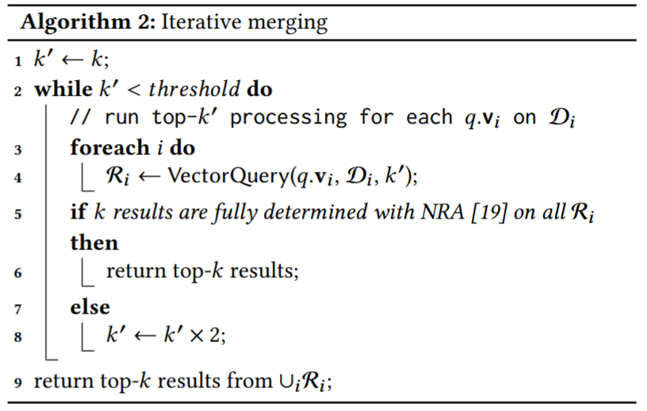
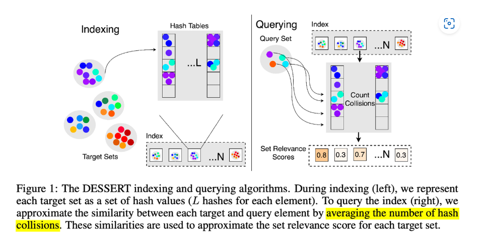
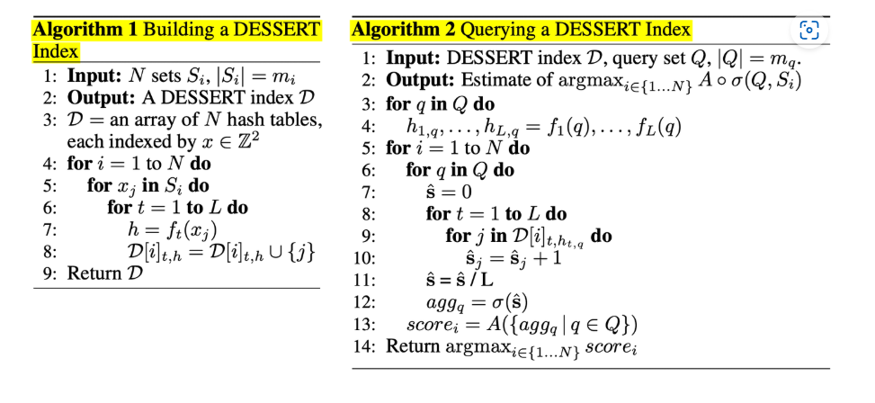

# Milvus

---

## Meta

- Milvus: A Purpose-Built Vector Data Management System
- Proceedings of the 2021 International Conference on Management of Data, 2021(==CCF-A==)

## Content

> Formally, each entity contains **μ** vectors $v_0, v_1, ..., v_{μ−1}$. Then a multi-vector query finds **top-k** entities according to an aggregated scoring function **g** over the similarity function **f (e.g., inner product)** of each individual vector **$v_i$** .

> In Milvus, we develop two new approaches, namely **vector fusion** and **interactive merging** that target for different scenarios.

**向量融合（Vector fusion）**

将一个向量集拼接成单一向量:$$[w0 × q.v0, w1 × q.v1, ..., wμ−1 × q.vμ−1]$$，适用于Inner Product Metric

So,这里的多向量检索貌似默认了向量集大小一致，且一一对应

And，由于欧几里得距离不可分解，这个方法也无法适用

**交互式合并(interactive merging)**

借助**NRA**算法(2001)

> [19] Ronald Fagin, Amnon Lotem, and Moni Naor. 2001. Optimal  Aggregation Algorithms for Middleware. In ACM Symposium on Principles of Database Systems (PODS). 102–113.

NRA中的TA在这里不适用，因为TA需要Random Access

**关于NRA和TA算法**

这两个属于多属性Top-K算法研究，于2001年提出。

所谓多属性Top-K,就是每个元素的score由多个属性决定，NRA（No Random Access）和TA（Threshold Algorithm），区别在于当迭代到某元素时，是否可以直接获取该元素的所有属性值（以直接计算分数）

## Related

- [官网对于多向量检索的解释](https://www.milvus-io.com/userGuide/search-query-get/multi-vector-search)

> 自 Milvus 2.4 版本以来，我们引入了多向量支持和混合搜索框架，这意味着用户可以将多个向量字段（最多 10 个）引入单个集合中。不同的向量字段可以表示不同的方面、不同的嵌入模型甚至是表征同一实体的不同的数据形态，这极大地扩展了信息的丰富性。这个特性在综合搜索场景中特别有用，比如基于各种属性（如图片、声音、指纹等）在向量库中识别最相似的人。

- [Github Discussion #23057](https://github.com/milvus-io/milvus/discussions/23057)

## Conclusion

所以，Milvus中的多向量检索，严格限制了每个集合中向量的个数，且具有有序性

而在Dessert中的多向量检索，并不限制集合中向量的顺序以及个数（尽管论文中为了简便，固定了每个向量集的大小）

---

# Dessert

---

## Meta

- DESSERT: An efficient algorithm for vector set search with vector set queries
- NIPS 2023(==CCF-A==)

## Content

简单来说就是通过L个Hash Function将每个集合内的每个高维向量映射到L个哈希值上

**建立三维索引D={（set_index，hash_func, hashed_value）: vector_index_list}，**

计算两个向量集的相似度的的复杂度从O()

## Related

- [Open Review](https://openreview.net/forum?id=kXfrlWXLwH)
- [知乎专栏](https://zhuanlan.zhihu.com/p/717756754)