# Milvus: A Purpose-Built Vector Data Management System

## Meta

- Milvus: A Purpose-Built Vector Data Management System
- Proceedings of the 2021 International Conference on Management of Data, 2021(==CCF-A==)

## Content

> Formally, each entity contains **μ** vectors $v_0, v_1, ..., v_{μ−1}$. Then a multi-vector query finds **top-k** entities according to an aggregated scoring function **g** over the similarity function **f (e.g., inner product)** of each individual vector **$v_i$** .

> In Milvus, we develop two new approaches, namely **vector fusion** and **interactive merging** that target for different scenarios.

**向量融合（Vector fusion）**

将一个向量集拼接成单一向量: $$[w0 × q.v0, w1 × q.v1, ..., wμ−1 × q.vμ−1]$$，适用于 Inner Product Metric

So, 这里的多向量检索貌似默认了向量集大小一致，且一一对应

And，由于欧几里得距离不可分解，这个方法也无法适用

**交互式合并(interactive merging)**

借助 **NRA** 算法(2001)

> [19] Ronald Fagin, Amnon Lotem, and Moni Naor. 2001. Optimal  Aggregation Algorithms for Middleware. In ACM Symposium on Principles of Database Systems (PODS). 102–113.

NRA 中的 TA 在这里不适用，因为 TA 需要 Random Access

**关于 NRA 和 TA 算法**

这两个属于多属性 Top-K 算法研究，于 2001 年提出。

所谓多属性 Top-K, 就是每个元素的 score 由多个属性决定，NRA（No Random Access）和 TA（Threshold Algorithm），区别在于当迭代到某元素时，是否可以直接获取该元素的所有属性值（以直接计算分数）

## Related

- [官网对于多向量检索的解释](https://www.milvus-io.com/userGuide/search-query-get/multi-vector-search)

> 自 Milvus 2.4 版本以来，我们引入了多向量支持和混合搜索框架，这意味着用户可以将多个向量字段（最多 10 个）引入单个集合中。不同的向量字段可以表示不同的方面、不同的嵌入模型甚至是表征同一实体的不同的数据形态，这极大地扩展了信息的丰富性。这个特性在综合搜索场景中特别有用，比如基于各种属性（如图片、声音、指纹等）在向量库中识别最相似的人。

- [Github Discussion #23057](https://github.com/milvus-io/milvus/discussions/23057)

## Conclusion

所以，Milvus 中的多向量检索，严格限制了每个集合中向量的个数，且具有有序性

而在 Dessert 中的多向量检索，并不限制集合中向量的顺序以及个数（尽管论文中为了简便，固定了每个向量集的大小）

---

# DESSERT: An efficient algorithm for vector set search with vector set queries

## Meta

- DESSERT: An efficient algorithm for vector set search with vector set queries
- NIPS 2023(==CCF-A==)

## Content

简单来说就是通过 L 个 Hash Function 将每个集合内的每个高维向量映射到 L 个哈希值上

**建立三维索引 D ={（set_index，hash_func, hashed_value）: vector_index_list}，**

计算两个向量集的相似度的的复杂度从 O()

关于其中 TinyTable 对整体性能的提升效果、InnerAgg 和 OuterAgg 的复杂度证明尚未明确。

哈希函数数量 L 作为超参，由用户指定的错误率决定，文中有大段证明

## Related

- [Open Review](https://openreview.net/forum?id=kXfrlWXLwH)

> Instead, we use collision statistics to rank sets based only on the distribution of hash codes, meaning that we do not store the d-dimensional embeddings.

Q1：将向量集映射到ND个哈希值上，仍然需要很大的存储开销和计算开销。关于这点，作者并未在paper中说明，而是解释使用Distribution代替了hash value的直接存储。

- [知乎专栏](https://zhuanlan.zhihu.com/p/717756754)

---

# [Bio-Based] Approximate vector set search: A bio-inspired approach for high-dimensional spaces

## Content

- Approximate Nearest Neighbor Search with Window Filters
- 松散的向量集检索。

> While the method proposed in [11]（**Dessert**） is an efficient algorithm that accelerates the vector set search process through hash table construction, it has limitations in terms of measures.

Dessert 在相似性度量方式上存在局限性（或者说，Dessert 不支持常见的 metric），这篇论文作为 Dessert 的补充，给出了高维向量集上 Hausdorf 距离度量的搜索方式。

> To address this gap, we focus on high-dimensional vector set search using Hausdorff distance.

$$
Haus(Q, V) = max(max_{q\in Q}\ min_{v\in V}\ dist(q,\ v),\ max_{v\in V}\ min_{q\in Q}\ dist(v,\ q)) \\
R = argmin_{V\in D}^{k}\ Haus(Q,\ V)
$$

**用到了 Bio-Inspired Hashing & Bloom Filter**

> [!quote]
>
> S. Dasgupta, C. F. Stevens, and S. Navlakha. A neural algorithm for a fundamental computing problem. Science, 358(6364): 793–796, 2017.

传统 LSH 通过 L 个哈希函数将高维向量映射到一个维度为 L 的 dense vector，而 FlyHash & BioHash 将高维向量映射到 bit sparse hash

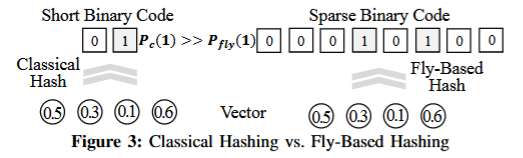

如以下算法及图例所示，Bio-LSH 会将每一个 d 维度向量 expand 到 m 维向量（随机投影），然后使用 WTA 策略选取 $L_{wta}$ 个最大的比特位置 1

进而，每一个向量集就转为了 **位向量集**

| 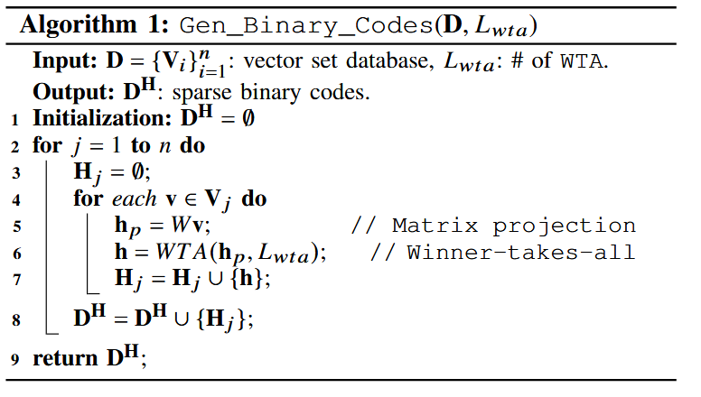 |      | 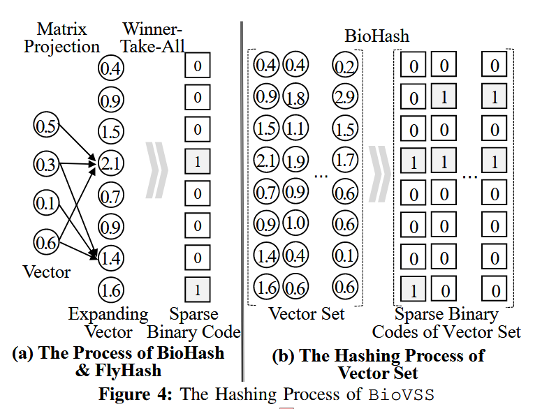 |      |      |      |      |
| :----------------------------------------------------------- | ---- | ------------------------------------------------------------ | ---- | ---- | ---- | ---- |
|                                                              |      |                                                              |      |      |      |      |

**Definitions**

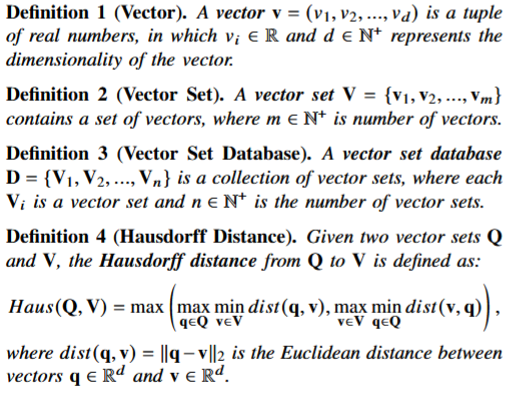

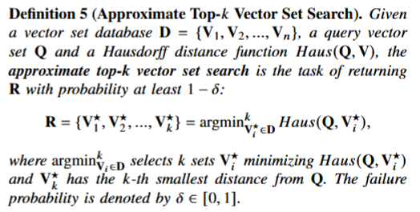

这里文中同样也给了一个 **错误率** 的定义

> Approximate top-k vector set search trades off speed and accuracy, permitting a small error in exchange for substantially improved search efficiency.

**Algorithm**

线性扫描版本

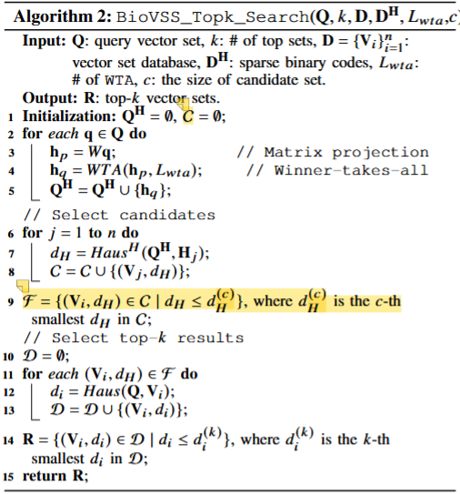

先计算位向量集的 Hausdorf 距离, 选取 c 个候选集，然后精确计算向量集的 Hausdorf 距离

基于 Count Bloom Filter 的倒排索引

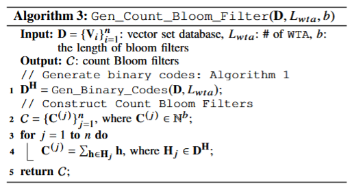

b: Dimension of Bloom Filter (mayber b <= m)

每个向量集拥有一个 Count Bloom Filter，记录所有 Sparse Vector 在每一位上的 bit sum

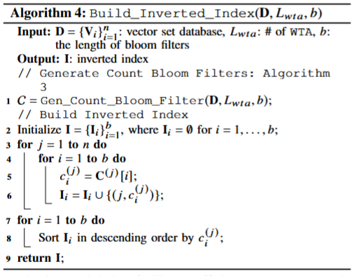

同时，每个向量集 V 也拥有一个 Binary Bloom Filter

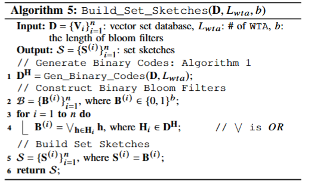

带过滤的搜索算法

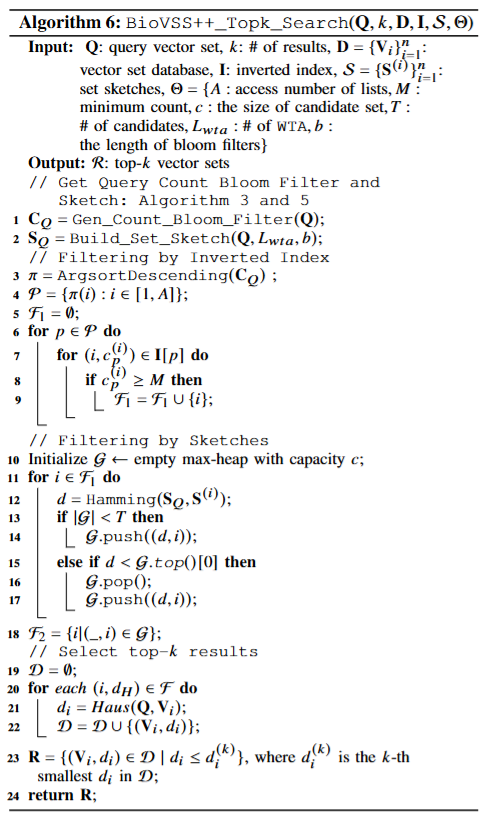

这里莫名其妙的引入了 M 这个超参数?

## Related

**Fly Hash**: A neural algorithm for a fundamental computing problem

**BioHash**: C. Ryali, J. Hopfield, L. Grinberg, and D. Krotov. Bio-inspired hashing for unsupervised similarity search. In ICML, volume 119, pages 82958306, 2020.

[MIT 关于BioHash的解释](https://www.youtube.com/watch?v=4lY-oAY0aQU)

---

# [FlyHash] A neural algorithm for a fundamental computing problem

## Content

- A neural algorithm for a fundamental computing problem(2017)

**和传统 LSH 的不同之处**

> it uses sparse, binary random projections to expand the dimensionality of the input, and it then sparsifies the tag using a winner-take-all circuit.
>
> 它使用稀疏的二进制随机投影来扩展输入的维度，然后使用赢家通吃电路对标签进行稀疏化。

**关于 LSH 的定义**

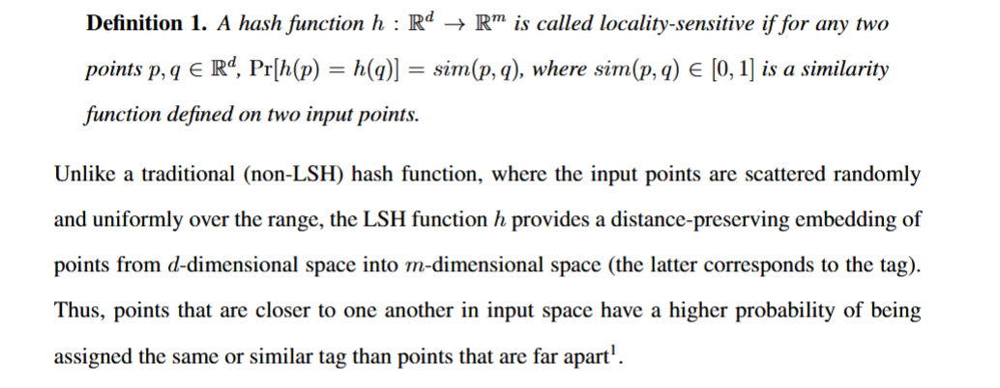

常用的方式是计算 data 的 random projection

> [!note]
>
> In practice, a second (traditional) hash function is used to place each m-dimensional point into a discrete bin so that all similar images lie in the same bin, for easy retrieval. In this paper, we focus only on designs for the LSH function, h.
>
> 在实践中，将 d 维数据映射到 m 维之后，可以用第二个 hash func 将 m 维数据映射到离散的 bin 中

**Fly 和 traditional LSH 的区别**

1. Fly 使用 sparse，binary random projections，而 LSH 用 dense projections(e.g. Guassian)，计算成本高
2. Fly 中的 m >> d，然后使用 winner-take-all 机制将 m 维向量稀疏化，而 LSH 是为了收缩维度

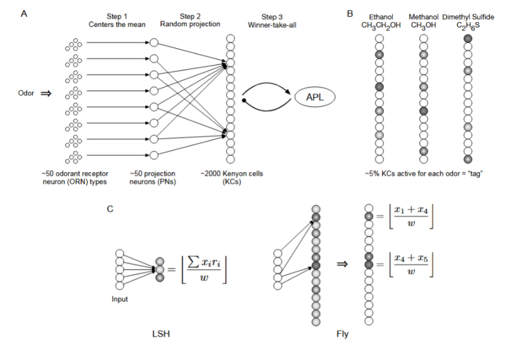

## Related

**BioHash**: C. Ryali, J. Hopfield, L. Grinberg, and D. Krotov. Bio-inspired hashing for unsupervised similarity search. In ICML, volume 119, pages 82958306, 2020.

上述 paper 改进了 FlyHash 的随机投影策略

---

# Plaid: an efficient engine for late interaction retrieval.

- 提出 PLAID 解决方案
- In Proceedings of the 31st ACM International Conference on Information & Knowledge Management, pages 1747–1756, 2022.

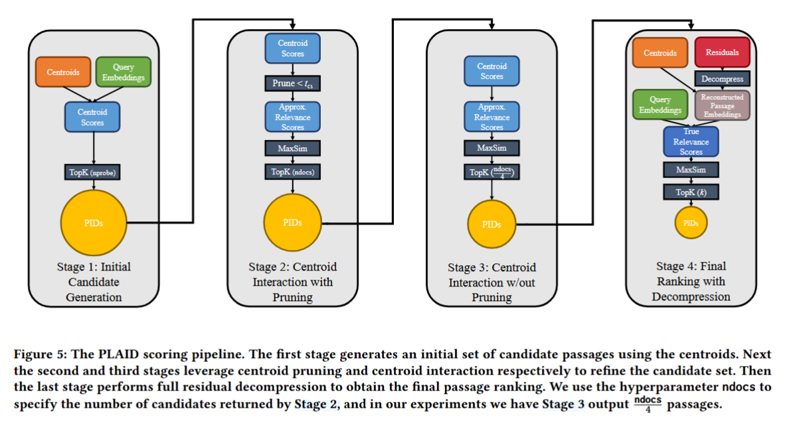

对向量集相似度的定义：
$$
S_{q,d} =  ∑︁  _{i =1}^{|Q|}  max_{j=1}^{|D|}  Q_i · D_j^T
$$
其中Q和D分别是向量集所组成的矩阵

Stage 1[**Candidate Generation**]: 根据查询向量集和质心的距离作Filter

> Trick1:质心矩阵C，查询矩阵Q，计算$S_{c,q}=C·Q^T$,筛选出 top-t个最近的质心
>
> Trick2:存储质心c向向量集ID的IVF，而不是Emebedding的全局ID（Like **Binary Bloom Filter**？）
>
> Trick3:ColBERTv2中候选集大小由**ncandidates**（超参数）决定，而PLAID会保留所有的候选集，等待过滤

**Stage 2**[**Centroid Interaction**]

$S_{c,q} = C\cdot Q^T,C:质心向量阵c\times d,Q：查询向量阵q\times d \ => \ c\times q$

$S_{c,q}[i][j]$ represents 第i个质心到q的Sim Score

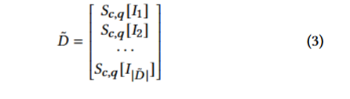

质心到各查询向量的Sim Score(距离矩阵)

按照论文中的做法，每个查询向量取Sim分数最高的质心，再求和后对所有结果进行Rank(MaxSim)
$$
S_{\widetilde D} = \sum_i^{|Q|}max_{j=1}^{|{\widetilde D}|}{\widetilde D}_{i,j}
$$
这个阶段会获得大小为ndocs的候选集

**Stage 3**[**Centroid Pruning**]

引入超参数$t_{cs}$进一步裁剪Stage2的候选集，要求Sim Vector中的所有分数都要高于这个值
$$
max_{j=1}^{|Q|}S_{c,q_{i,j}} \ge t_{cs}
$$
启发式方法,这个阶段会获取大小为ndocs/4的候选集（效果最好）

**Stage 4**[**Scoring**]计算精确值

## A reproducibility study of plaid（2024）

> These multi-stage pipelines are complex and highly sensitive to parameter setting, as recently demonstrated in a reproducibility study [37], making them difficult to tune.
>
> ——— MUVERA

# MUVERA: Multi-Vector Retrieval via Fixed Dimensional Encodings

## 核心算法

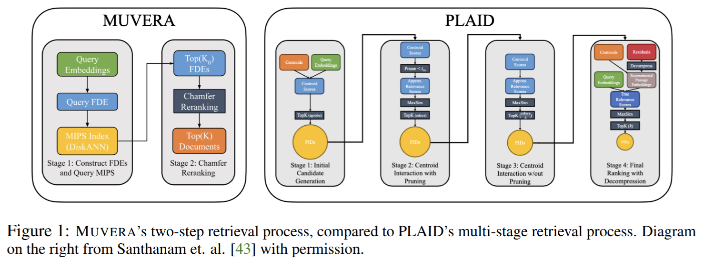

The author reduces MV similarity search to SV search

> PLAID employs a complex four-stage retrieval and pruning process to gradually reduce the number of final candidates to be scored

> Additionally, this process is expensive, since it requires querying a significantly larger MIPS index for every query embedding (larger because there are multiple embeddings per document).

相似度定义：$CHAMFER(Q, P ) = ∑_{q∈Q}\ \ \max_{p∈P} 〈q, p〉$

NNS Task：$P^∗ = arg max_{P_i∈D} CHAMFER(Q, P_i)$

**Fixed Dimensional Encodings(FDEs)**

Dest:将查询向量集和候选向量集压缩为两个单向量，使其内积近似等于CHAMFER相似度

将d维space划分位B个clusters。partition方法可以是LSH, K-Means，.etc.

$CHAMFER(Q, P ) =  ∑_{k=1}^B  ∑_{q∈Q,φ(q)=k} max_{p∈P,φ(p)=k}〈q, p〉$

then, 查询集和候选集均被拆分为多个子向量集的相似度

in this way, 如果某**子向量集**中只分配到一个向量，那么这个分区的相似度计算是线性的，而如果有多个，还是无法避免全排列计算相似度，因此，每个分区下取一个中心向量。
$$
q~(k) = ∑_{q∈Q,φ(q)=k}  q, \\p~(k) = \frac{1}{|P ∩ φ^{-1}(k)|}  ∑_{p∈P, φ(p)=k}  p
$$
然后,

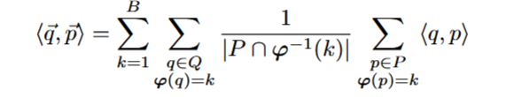

同时，为了使各向量集的最终维度统一，对分区后的向量集做随机投影

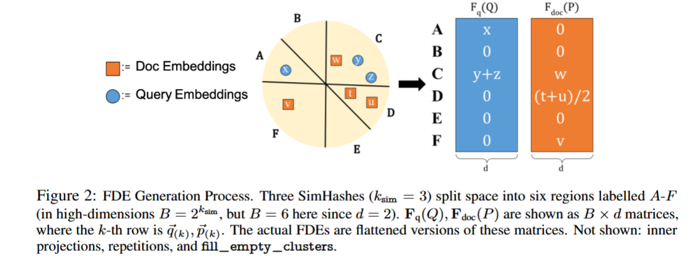

**Filling Empty Clusters**

B代表分区的个数，如果B越大，则结果越精确，但也会降低冲突概率。为了减少超参数B对recall的支配效果，文中将空的cluster分配一个最近的向量。但是，文中也认为这样做会导致冗余计算，默认不开启

**Dataset**

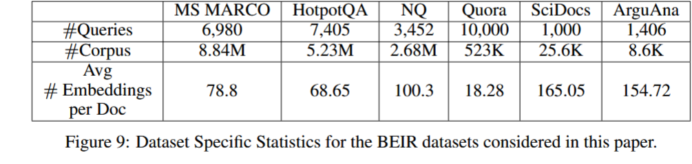

不公开源代码

## Questions

Q1: 是将多向量转为单向量还是说固定它们的映射关系？

A1: 根据Figure 2中所述，会变成$B\times d$的矩阵

## Related

[Open Review](https://openreview.net/forum?id=X3ydKRcQr6)

